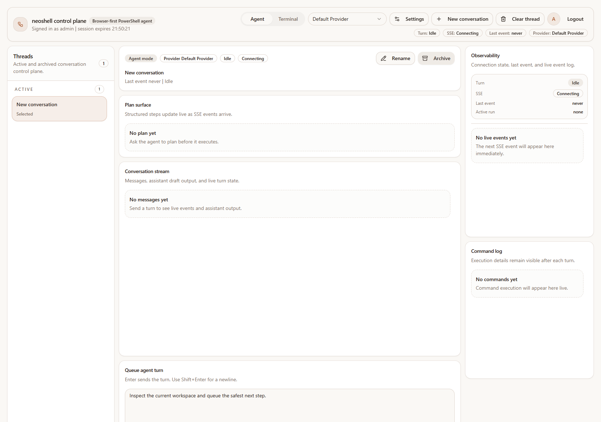

# README product screenshot capture

*2026-03-24T13:51:28Z by Showboat 0.6.1*
<!-- showboat-id: af15ae32-edcf-4f49-a3bd-c0661f26cea2 -->

The screenshot in README was generated by running `scripts/capture-readme-screenshot.ps1`, which boots temporary local services against a temporary SQLite database and writes `docs/images/neoshell-product.png`.

```bash {image}
.\docs\images\neoshell-product.png
```


